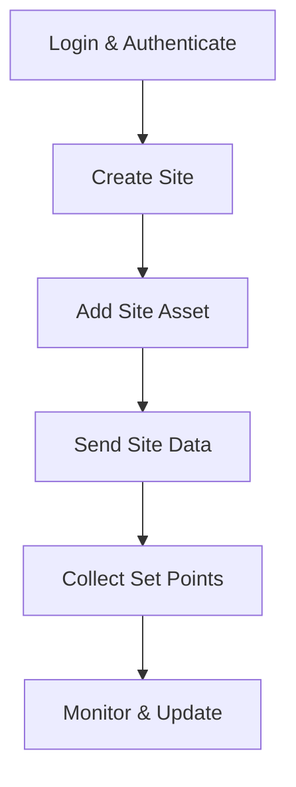

The CloudFlex API enables organizations to manage their virtual sites.

## Development Levels

The CloudFlex API is available in three different stages, each designed for a specific purpose:

<AccordionGroup>
    <Accordion title="Next">
        Where the newest features land first. The Next stage is for testing bleeding-edge code, so things here may not always work as expected.<br/>
        <Link href="https://api.io-comms.com/next/">https://api.io-comms.com/next/</Link>
    </Accordion>
    <Accordion title="Development">
        Features preparing for production are tested here. The Development stage is great for getting ready for upcoming changes, but be aware that things can still break.<br/>
        <Link href="https://api.io-comms.com/dev/">https://api.io-comms.com/dev/</Link>
    </Accordion>
    <Accordion title="Production" defaultOpen="true">
        This is the stable release, where all features have been thoroughly tested and are ready for everyday use.<br/>
        <Link href="https://api.io-comms.com/v1/">https://api.io-comms.com/v1/</Link>
    </Accordion>
</AccordionGroup>

<Warning>
    For third-party integrations, we recommend using the <b>Production</b> or <b>Development</b> stages. The <b>Next</b> branch is intended mainly for internal testing and may not be reliable for external use.
</Warning>

## Login

All CloudFlex API endpoints require a JSX bearer token for authentication. You can obtain this token by sending a POST request to the login endpoint with your partner username and password. Here’s how to do it in various languages:

<CodeGroup>

    ```python login.py
    import requests

    url = "https://api.io-comms.com/v1/auth/login"
    data = {
    "username": "<USER_EMAIL>",
    "password": "<USER_PASSWORD>"
}
    headers = {"Content-Type": "application/json"}
    response = requests.post(url, json=data, headers=headers)
    print(response.json())
    ```

    ```javascript login.js
    const fetch = require('node-fetch');

    const url = 'https://api.io-comms.com/v1/auth/login';
    const data = {
    username: '<USER_EMAIL>',
    password: '<USER_PASSWORD>'
};
    fetch(url, {
    method: 'POST',
    headers: { 'Content-Type': 'application/json' },
    body: JSON.stringify(data)
})
    .then(res => res.json())
    .then(json => console.log(json));
    ```

    ```bash login.sh
    curl --location 'https://api.io-comms.com/v1/auth/login' \
    --header 'Content-Type: application/json' \
    --data-raw '{
    "username": "<USER_EMAIL>",
    "password": "<USER_PASSWORD>"
}'
    ```

</CodeGroup>

The output will look like this:

```json
{
  "token": "<JSX_BEARER_TOKEN>",
  "refreshToken": "<REFRESH_TOKEN>",
  "type": "partner" // can also be "admin" or "consumer"
}
```
Explanation:

<ResponseField name="token" type="string">
    The JSX bearer token, to be used on protected calls
</ResponseField>
<ResponseField name="refreshToken" type="string">
    Use this token to refresh your session without needing to log in again with your username and password.
</ResponseField>
<ResponseField name="type" type="string">
    <Expandable title="Possible values">
        <ResponseField name="admin" type="string">Lifepowr Admin user (rare for third parties)</ResponseField>
        <ResponseField name="partner" type="string">Partner user (most common for partners)</ResponseField>
        <ResponseField name="consumer" type="string">End user (typically at the app level)</ResponseField>
    </Expandable>
</ResponseField>

---

## CloudFlex API Workflow Example

Below is a typical workflow for using the CloudFlex APIs to manage your virtual sites and assets:



---

### Authenticate
- Send a POST request to the [login endpoint](/pages/api/introduction) with your credentials to obtain a bearer token.

### Create a Site
- Use the [Create Site](/pages/api/create-sites) endpoint to register a new virtual site.

### Add Assets to the Site
- Use the [Add Site Asset](/pages/api/add-site-asset) endpoint to associate assets with your site.

### Send Device Data
- Periodically send operational data to your site using the [Send Site Data](/pages/api/send-site-data) endpoint.

### Collect Set Points
- Retrieve the latest set points for your site using the [Collect Set Points](/pages/api/collect-set-points) endpoint and apply them to your devices.

### Monitor and Update
- Use [List Sites](/pages/api/list-sites), [Basic Site Information](/pages/api/basic-site-information), and [Site Savings & Earnings](/pages/api/site-savings-earnings) to monitor your sites.
- Edit or remove sites/assets as needed using the appropriate endpoints.

<Tip>Repeat steps 4 and 5 in a loop to keep your virtual site data and control set points up to date.</Tip>
