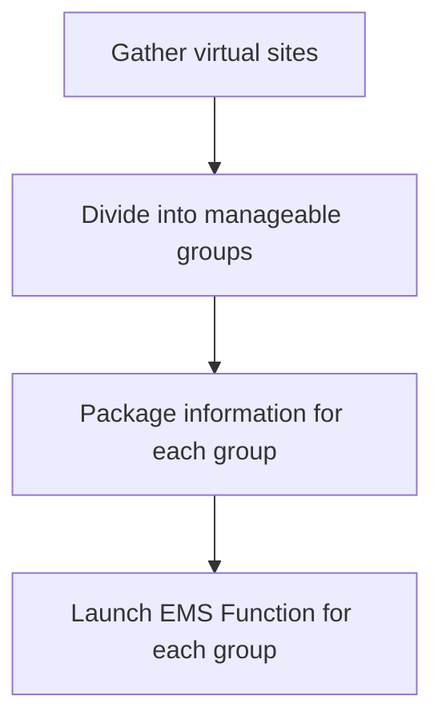
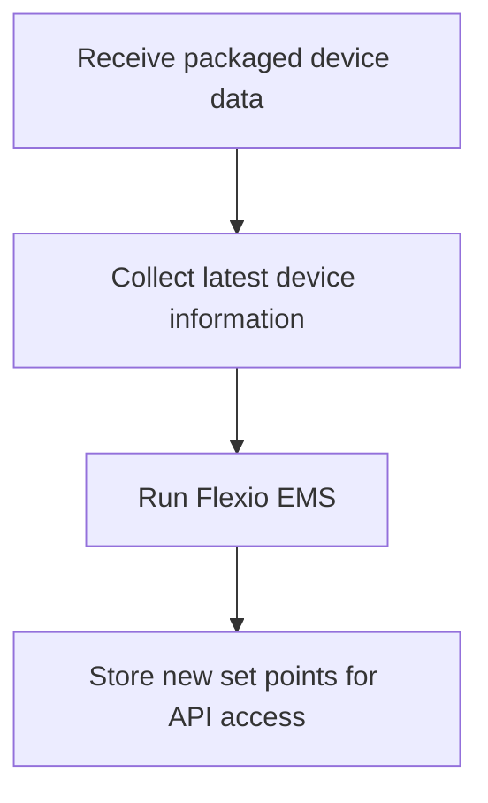

There are two main components in the EMS Loop:

## Orchestrator Function

The orchestrator acts as the central coordinator. Every minute it will

This approach ensures the system remains organized and scalable.

## EMS Function

The EMS function will

The EMS function is designed to run concurrently and on-demand, as triggered by the orchestrator.