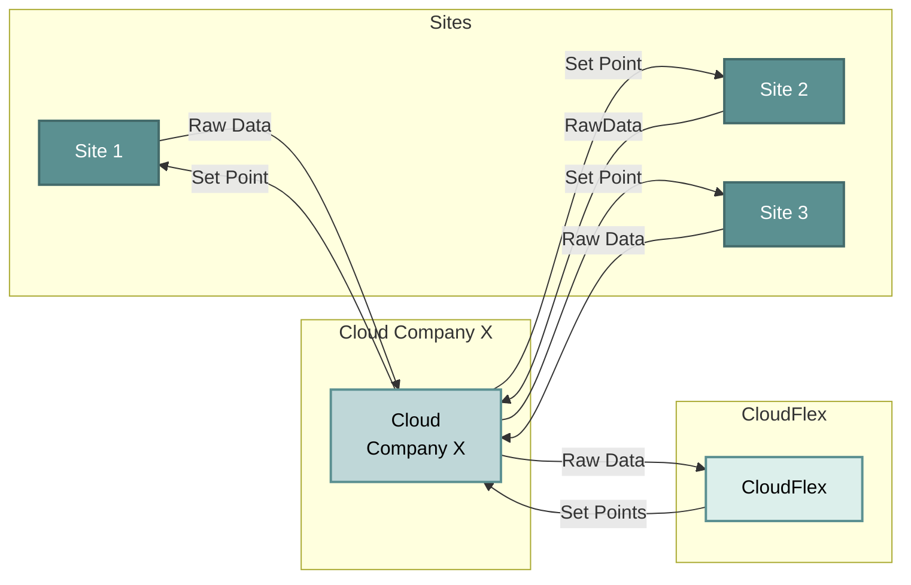

## Purpose

CloudFlex allows control of supported Flexio EMS devices that are not available to install a Flexbox on their sites. These sites, however, must have or be willing to implement a cloud-based control infrastructure of their devices (towards which the market seems to be gravitating).

Another segment to capture will be devices with a “dumb” local EMS that are willing to perform the operation of sending the data and polling for set points.

## Use cases

<CardGroup cols={2}>
  <Card
    title="Enterprise"
    icon="building"
    href="/pages/use-cases/enterprise"
  >
      The enterprise model involves a single actor managing multiple diverse sites, handling device control operations themselves, but lacking the resources or logic to operate their own EMS.
  </Card>
  <Card
    title="End users"
    icon="user"
    href="/pages/use-cases/end-users"
  >
      The end user model is for sites with devices that are compatible with CloudFlex integration.
  </Card>
</CardGroup>

## Setup

To begin setting up your virtual site with CloudFlex, simply head over to the [Get started](/pages/api/introduction) page.
Here we will guide you through the initial steps, including obtaining your credentials and preparing your environment for seamless integration with the CloudFlex APIs.

<Tip>A virtual site is a digital version of your location.</Tip>

## Infrastructure

<CardGroup cols={3}>
    <Card
        title="CloudFlex API"
        icon="cloud"
        href="/pages/api/introduction"
    >
        Handles the management of sites, site assets and fleets.
    </Card>
    <Card
        title="Cloud EMS Loop"
        icon="zap"
        href="/pages/infrastructure/cloud-ems-loop"
    >
        The process that keeps the sites up to date and creates set points based on gathered data
    </Card>
    <Card
        title="Integrations LoopCloud EMS Loop"
        icon="blocks"
        href="/pages/infrastructure/cloud-ems-loop"
    >
        Orchestrates and manages the gathering of data from relevant devices using the appropriate device brand's APIs
    </Card>
</CardGroup>